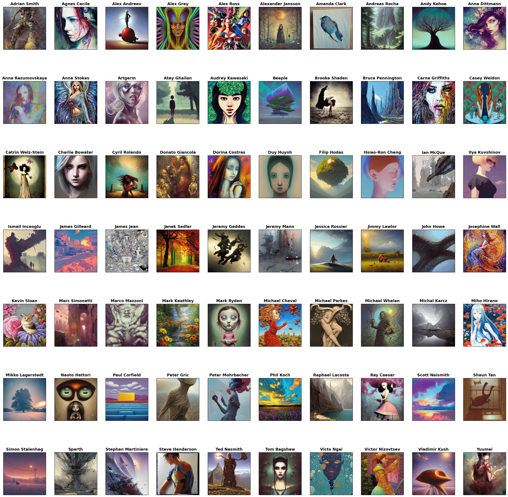

# Measuring the Success of Diffusion Models at Imitating Human Artists

Stephen Casper,* MIT, [scasper@mit.edu](scasper@mit.edu)

Carl Guo,* MIT, [carlguo@mit.edu](carlguo@mit.edu) 

Shreya Mogulothu, MIT

Chinmay Deshpande, Harvard

Zachary Marinov, MIT

Rui-Jie Yew, MIT/Brown

Zheng Dai, MIT

Dylan Hadfield-Menell, MIT

---

Repository update -- July 2023:

See the paper [here](https://genlaw.github.io/CameraReady/49.pdf), which has now been accepted to the GenLaw, 2023 workshop.

See our interactive code notebook [here](https://colab.research.google.com/drive/1ScHo9uMdUgId0DlSr4W4RgnMD44dLiku?usp=sharing) or download it from here in the repository :)

